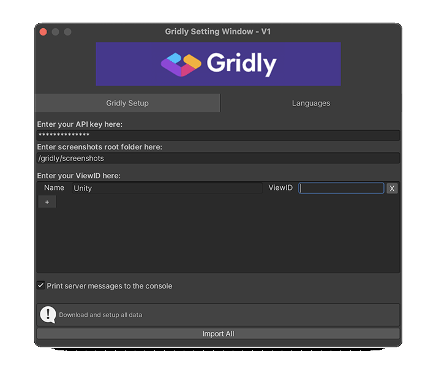
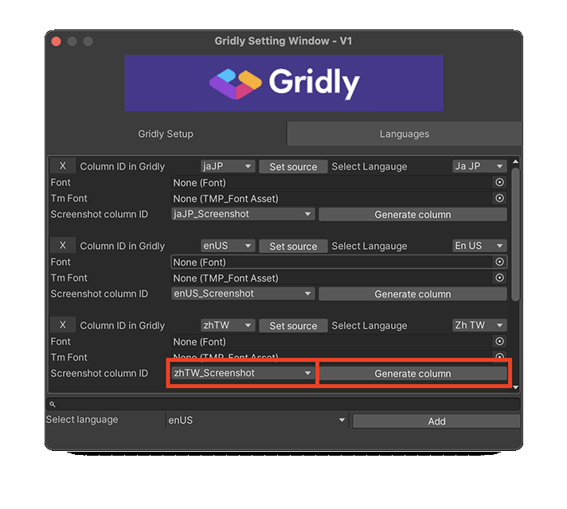

# Gridly Unity プラグイン
### 1. このプラグインでできること
このプラグインは、Unity と Gridly 間のデータ同期を支援します。
Unity で生成されたスクリーンショットのアップロード機能もあります。
パスを使うことで、ターゲット言語の文字列データを取得できます。

### 2. Gridly で最初のカラムをセットアップする
このプラグインを使えるようにするためには、いくつかの初期化手順が Gridly 上で必要です。プラグインが正しいカラムを参照できるようにするためです。まず最初に、**columnID** を指定する必要があります。ソース言語カラムから指定してください。
プラグインで使用する Grid を Gridly から開き、ソース言語カラムのヘッダから、**Column properties** を選んでください。

columnID をカラム名に記載されている4文字の言語コードに変更してください。
大文字小文字も同様に変更してください。2文字の国コードは大文字です。

### 3. Unity と Gridly を接続する
### 3.1 プラグインのインストール手順
- GitHub からコードをダウンロードZIPする
- パッケージを解凍する
- パッケージ内の Gridly フォルダーを Unity プロジェクトのアセットフォルダーにドラッグ＆ドロップする

### 3.2 Unity でのセットアップ
最初に Grildy 設定 ウィンドウ
**Tools**->**Gridly**->**Setup Setting** から開いてください。

API キーを入力してください。また、生成されたスクリーンショットを格納するフォルダーを指定してください。

API キーは、Gridly の Grid 右ペインの API クイックスタートメニューから取得できます。

このプラグインは、デフォルトで2つのビューを追加しますが、これはダミーです。削除しても改名しても構いません。
プラスアイコンから新しいビューを追加できます。

### 3.3 プラグインを使って言語を管理する
* リストボックスで言語を選択し "Add" ボタンをクリックすると、言語の追加ができます。
Unity プロジェクト内で言語を追加すると、Gridly にもカラムが追加されます。

* "X" ボタンをクリックすると、言語の削除ができます。言語を削除すると、2つのダイアログが表示されます。最初のダイアログでは、どの言語を Unity から削除するか、二つ目のダイアログでは、選択した言語と、その言語にひもづくスクリーンショットを Gridly から消すかを確認されます。

* どのフォントを使用するか、 "Font" もしくは "TmFont" 設定から選択できます。TmFont は Text Mesh Pro フォントです。
* "Screenshot column ID" の横にあるドロップダウンメニューをクリックすることで、言語ごとの画像を格納するカラムを選択できます。
画像格納用カラムがない場合は、"Generate column" ボタンをクリックすることで、 Gridly に "files" タイプのカラムを作成できます。それから column ID を一覧から選択してください。

  

* プロジェクトのソース言語は、"Set source" ボタンをクリックすると変更できます。
* 言語の column ID は、"Column ID in Gridly" ラベルの横のドロップダウンリストを選択すると変更できます。
* 言語コードは、"Select language" ドロップダウンリストから変更できます。

### 4. 文字列の編集
### 4.1 文字列エディターウィンドウ
文字列エディターウィンドウを開くには、 **Tool**->**Gridly**->**String Editor** を選択します。

  
**Path** : 文字列のあるシーンを選択できます。シーンのスクリーンショットをアップロードする場合に必要です。
**Delete** : Gridly と Unity のレコードを削除します。
**Rename** : Gridly と Unity のキーを改名します。  
**Create Record** : string ID の指定をしてから"Create Record" ボタンを叩くと、レコードを生成します。
**Pull selected grid** : 選択した Grid のすべてのデータをダウンロードします。
**Pull all grids** : 設定されたすべての Grid のすべてのデータをダウンロードします。
**Push options** : Gridly にデータをプッシュする際、どのデータをアップロードするか選べます。

    

> **Source text** : ソース言語文字列のみを Grildy にプッシュします。
**Source text and screenshots**: ソース言語文字列と関連するソーススクリーンショットを Grildy にプッシュします。
**Language screenshots** : なにか言語を選択すると、選択された言語のスクリーンショットをカラムにアップロードします。

**Push only changed records** : ローカルの Unity で変更されたデータのみを Gridly にプッシュします。

### 4.2 実行時のデータ同期
このコンポーネントは、ゲームのリビルドを行わずに Gridly からデータを取得します。

    
**注意** : Gridly からのデータの取得は、development/staging 環境で行われるべきです。
live/public オブジェクトの更新は、推奨しません。

### 4.3 テキストの翻訳
+ ターゲット言語の設定には、次の **void** を使います。

  

+ テキストの取得には、次の **void** を使います。

    

+ UI 翻訳テキストの設定には、次のコンポーネントを使います。

    

### 5. スクリーンショットジェネレーターの例
### 5.1 スクリプトのセットアップ
Gridly/ScreenshotSceneUtility 内の ScreenshotTaker シーンは、スクリーンショットの生成中に選択する言語や、スクリーンショット生成の長さ、シーン変更後のスクリーンショット撮影まで何秒待つかなどを定義できます。

    

> ドロップダウンリストから言語を選択し、"Add" ボタンをクリックすることで、言語を追加できます。
同様に "Remove" から削除ができます。追加された言語は "Added languages" 一覧に表示されます。

スクリーンショットの生成中は、すべてのシーンは "Scenes in Build" 一覧に追加されます。
**File**->**Build settings** からシーンの追加ができます。

    

スクリーンショットは、Gridly 設定メニューで入力したフォルダパスに保存されます。
スクリプトによって、各言語のサブフォルダが作成されます。
スクリーンショットの生成手順は、再生ボタンからシーンを再生することで開始されます。

    
