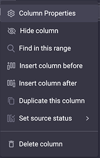

# Gridly Unity プラグイン <a href="https://github.com/gridly-spreadsheet-CMS/gridly-unity-plugin">本家（英語）</a>

  <a href="README-en.md">English</a>
  / 
  <a href="README-ja.md">Japanese</a>

### 1. このプラグインでできること
Unity と Gridly 間のデータ同期を支援します。
Unity で生成されたスクリーンショットを Gridly にアップロードしたり、
ターゲット言語の文字列データを取得できます。

### 2. Gridly をセットアップする
このプラグインを使うためには、Gridly 上でのセットアップが必要です。
プラグインがカラムを正常に参照するため、**columnID** を変更します。
ソース言語のカラムは、必ず変更してください。
Gridly から Grid を開き、カラムのヘッダから、**Column properties** を選んでください。

Column IDは、 Language に記載されている括弧内の4文字の言語コードに合わせます。
jaJP のように大文字小文字を一致させてください。後ろ2文字の国コードは大文字です。

### 3. Unity と Gridly を接続
### 3.1 Unity プラグインのインストール
- GitHub からコードを <a href="https://github.com/nozomu-matsui/gridly-unity-plugin/archive/refs/heads/master.zip">ダウンロードZIP</a> します。
- パッケージを解凍します。
- パッケージ内の Gridly フォルダーを Unity プロジェクトのアセットフォルダーにドラッグ＆ドロップします。

### 3.2 Unity での Gridly セットアップ
最初に Grildy 設定 ウィンドウを
**Tools**->**Gridly**->**Setup Setting** から開いてください。

API キーを入力してください。また、生成されたスクリーンショットを格納するフォルダーを指定してください。

API キーは、Gridly の Grid 右ペインの API クイックスタートメニューから取得できます。

インストール直後のプラグインには、すでにビューが存在しますがダミーです。削除しても改名しても構いません。
プラスアイコンからビューを追加できます。

### 3.3 プラグインを使って言語を管理する
* リストボックスで言語を選択し "追加" ボタンをクリックすると、言語の追加ができます。
Unity プラグインから言語追加すると、Gridly にもカラムが追加されます。

* "X" ボタンから言語の削除ができます。その際、ダイアログが2回表示されます。最初はどの言語を Unity から削除するか、二つ目は、選択した言語のスクリーンショットも Gridly から消すかを確認されます。

* どのフォントを使用するか、 "Font" もしくは "TmFont" 設定から選択できます。TmFont は Text Mesh Pro フォントです。
* "画像格納用カラムID" の横にあるドロップダウンメニューをクリックすることで、言語ごとに画像を格納するカラムを選択できます。
Gridly に画像格納用カラムがない場合は、"カラムを作成" からカラム作成できます。作成後に column ID を選択してください。

* プロジェクトのソース言語は、"ソース言語に選択" ボタンをクリックすると変更できます。
* 言語の column ID は、"カラムID" ラベルの横のドロップダウンリストを選択すると変更できます。
* 言語コードは、"選択言語" ドロップダウンリストから変更できます。

### 4. 文字列の編集
### 4.1 文字列エディターウィンドウ
文字列エディターウィンドウを開くには、 **Tool**->**Gridly**->**String Editor** を選択します。

  
* **パス** : 文字列のあるシーンを選択できます。シーンのスクリーンショットをアップロードする場合に必要です。
* **削除** : Gridly と Unity のレコードを削除します。
* **改名** : Gridly と Unity のキーを改名します。  
* **レコードを作成** : string ID の指定をしてから"レコードを作成" ボタンを叩くと、レコードを生成します。
* **選択したグリッドをプル** : 選択した Grid のすべてのデータをダウンロードします。
* **すべてのグリッドをプル** : 設定されたすべての Grid のすべてのデータをダウンロードします。
* **プッシュオプション** : Gridly にデータをプッシュする際、どのデータをアップロードするか選べます。

    

* **ソース文字列** : ソース言語文字列のみを Grildy にプッシュします。
* **ソース文字列とスクリーンショット**: ソース言語文字列と関連するソーススクリーンショットを Grildy にプッシュします。
* **ターゲット言語のスクリーンショット** : 選択されたターゲット言語のスクリーンショットを Gridly にアップロードします。

* **変更レコードのみプッシュ** : ローカルの Unity で変更されたデータのみを Gridly にプッシュします。

### 4.2 実行時のデータ同期
このコンポーネントは、ゲームのリビルドを行わずに Gridly からデータを取得します。

    
**注意** : Gridly からのデータの取得は、development/staging 環境で行われるべきです。
live/public オブジェクトの更新は、推奨しません。

### 4.3 テキストの翻訳
+ ターゲット言語の設定には、次の **void** を使います。

  

+ テキストの取得には、次の **string** を使います。

    

+ UI 翻訳テキストの設定には、次のコンポーネントを使います。

    

### 5. スクリーンショットジェネレーター
### 5.1 ScreenshotTaker のセットアップ
Gridly/ScreenshotSceneUtility フォルダにある ScreenshotTaker シーンは、
* スクリーンショットを撮影する言語
* シーンが切り替わった何秒後に、スクリーンショットを撮影する
などを定義できます。

    

ドロップダウンリストから言語を選択し、"追加" で言語を追加できます。
同様に "削除" から削除ができます。追加された言語は "追加された言語一覧" に表示されます。

"Scenes in Build" 一覧に追加されているシーンにて、スクリーンショットを撮影します。
Unity メニューの **File**->**Build settings** から、Unity で開いているシーンが "Scenes in Build" に追加できます。

    

スクリーンショットは、Gridly 設定メニューで指定したフォルダパスに、言語別のサブフォルダが作成され、保存されます。
スクリーンショットは、ScreenshotTaker シーンを再生することでボタンからシーンを再生すると撮影が開始されます。

    
